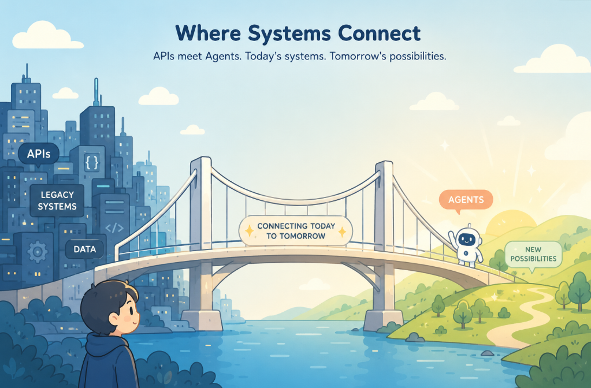

# EasyMCP

<p align="center">
  
</p>

EasyMCP turns existing OpenAPI services into MCP tools that AI agents can discover, inspect, and use.

If you already have APIs, EasyMCP gives you a practical path from “we have endpoints” to “Codex, Claude, and other agents can safely work with these tools” without publishing private source code or writing a custom MCP server for every service.

## Install in One Command

```bash
curl -fsSL https://raw.githubusercontent.com/ab0t-com/easymcp/main/install.sh | bash
```

Verify:

```bash
easymcp --version
easymcp --help
```

## See the Value Quickly

Create an MCP server from an OpenAPI spec:

```bash
easymcp create auth-service \
  --openapi https://auth.service.ab0t.com/openapi.json \
  --group auth
```

Start it and verify it is ready:

```bash
easymcp start auth-service --wait
easymcp check auth-service
```

Docker for MCP

```bash
ubuntu@dev-ab0t:~/app/mcp$ easymcp ps
NAME          GROUP  TYPE     STATUS   HEALTH   PORTS                       URL                         IMAGE                   PID    
------------  -----  -------  -------  -------  --------------------------  --------------------------  ----------------------  -------
auth-service  auth   easymcp  running  healthy  0.0.0.0:10500->10500/tcp,…  http://localhost:10500/mcp  ab0tcom/easymcp:v0.1.0  2032738
petstore      -      easymcp  running  healthy  8000/tcp, 0.0.0.0:9001->9…  http://localhost:9001/mcp   ab0tcom/easymcp:v0.1.0  1990745
```

Discover what tools it exposes:

```bash
easymcp discover refresh
easymcp discover refresh auth-service
easymcp find "I need to create an API key" --instance auth-service
```

`find` searches the cached discovery index built from the service OpenAPI document. Bare `discover refresh` refreshes all registered instances; passing a name refreshes one. Refresh reads operation names, endpoints, descriptions, parameters, schemas, auth hints, and other tool metadata, embeds those tool records into a vector index, and stores the vectors plus metadata in the local EasyMCP cache. Search combines vector similarity with keyword signals, so humans and agents can ask by intent instead of memorizing generated tool names.

Without an OpenAI key, EasyMCP uses its local `hashed_bow` vectorizer. It is built in, free, deterministic, and does not call an external API. When `EASYMCP_OPENAI_API_KEY` or `OPENAI_API_KEY` is configured, OpenAI-backed `openai_openapi_fulltext` becomes the default discovery/search strategy so users do not need strategy flags for normal use.

```bash
export EASYMCP_OPENAI_API_KEY="sk-..."
# OPENAI_API_KEY is also accepted when EASYMCP_OPENAI_API_KEY is not set.

easymcp discover refresh --yes
easymcp find "create me a api key please" --instance auth-service
```

OpenAI embedding strategies use your OpenAI API key and may bill your account. Refresh and eval require informed consent before paid embedding calls. Use `--yes` for one command, or use `--approve-paid-api` once to save consent in `~/.easymcp/settings.json`:

```bash
easymcp discover refresh --approve-paid-api
easymcp settings show
easymcp settings paid-api revoke
```

EasyMCP sends OpenAPI-derived tool metadata for embedding, not runtime call payloads or downstream API tokens. Cached vectors are reused when the document hash, strategy, provider, and model are unchanged. To force local/offline behavior while a key is present, set `EASYMCP_EMBEDDING_PROVIDER=hashed_bow` or pass `--strategy mcp_thin`.

Keep secrets out of your OpenAPI examples and descriptions. When an OpenAI-backed strategy is selected, any text inside the spec — including `example` values, parameter descriptions, and field summaries — is eligible to be sent to the embedding API. Treat your OpenAPI spec the way you would treat shared documentation.

Example intent search:

```bash
easymcp find "create me a api key please"
```

Output:

```text
╭───────────────────────────────────────────────────────────────────────────────────────────────────────────────────────────╮
│ Top Match                                                                                                                 │
│ Query: create me a api key please                                                                                         │
│ Tool: create_api_key_api_keys                                                                                             │
│ Scope: auth-service / -                                                                                                   │
│ Endpoint: POST /api-keys/                                                                                                 │
│ Action: mutates                                                                                                           │
│ Auth: requires BearerJWT                                                                                                  │
│ Summary: Create API key for service-to-service auth. Input: {name, permissions?, rate_limit?, expires_at?, metadata?} …   │
│ Commands                                                                                                                  │
│   Inspect:  easymcp discover inspect create_api_key_api_keys --instance auth-service                                      │
│   Template: easymcp discover inspect create_api_key_api_keys --instance auth-service --payload-template                   │
│   Dry Run:  easymcp call create_api_key_api_keys --instance auth-service --yes --data '{"name":"Example Name"}' --dry-run │
│   Call:     easymcp call create_api_key_api_keys --instance auth-service --yes --data '{"name":"Example Name"}'           │
│                                                                                                                           │
│ Auth                                                                                                                      │
│   Requires BearerJWT; configure credentials on the instance/profile before calling.                                       │
╰───────────────────────────────────────────────────────────────────────────────────────────────────────────────────────────╯

Results for "create me a api key please" • 10 matches
─────────────────────────────────────────────────────
RANK  TOOL                                                      SCOPE             ENDPOINT                                ACTION   AUTH                          SUMMARY                                                                   SCORE
----  --------------------------------------------------------  ----------------  --------------------------------------  -------  ----------------------------  ------------------------------------------------------------------------  -----
1     create_api_key_api_keys                                   auth-service / -  POST /api-keys/                         mutates  requires BearerJWT            Create API key for service-to-service auth. Input: {name, permissions?,…  0.64
2     delete_api_key_api_keys                                   auth-service / -  DELETE /api-keys/{key_id}               mutates  requires ApiKeyBearer, Bear…  Permanently revoke an API key. Input: key_id in path Auth: Bearer token…  0.63
3     update_api_key_api_keys                                   auth-service / -  PUT /api-keys/{key_id}                  mutates  requires ApiKeyBearer, Bear…  Update an API key's name, permissions, or status. Input: {name?, permis…  0.61

Next Steps
──────────
Inspect best match: easymcp discover inspect create_api_key_api_keys --instance auth-service
Generate payload template: easymcp discover inspect create_api_key_api_keys --instance auth-service --payload-template
Dry-run the call: easymcp call create_api_key_api_keys --instance auth-service --yes --data '{"name":"Example Name"}' --dry-run
Execute when ready: easymcp call create_api_key_api_keys --instance auth-service --yes --data '{"name":"Example Name"}'
Auth: Requires BearerJWT; configure credentials on the instance/profile before calling.
```

Inspect a tool before using it:

```bash
easymcp discover inspect create_api_key_api_keys \
  --instance auth-service \
  --payload-template
```

Dry-run a call before executing it:

```bash
easymcp call create_api_key_api_keys \
  --instance auth-service \
  --data '{"name":"demo-key"}' \
  --dry-run
```

Execute only when intentional:

```bash
easymcp call create_api_key_api_keys \
  --instance auth-service \
  --data '{"name":"demo-key"}' \
  --yes
```

That is the core loop: create, start, check, discover, find, inspect, dry-run, call.

## What You Get

- **OpenAPI to MCP**: turn existing API contracts into agent-usable tools.
- **Docker runtime**: run EasyMCP from a public image instead of cloning private server code.
- **CLI control plane**: create, start, stop, restart, inspect, discover, search, call, profile, and install MCP instances.
- **Agent setup**: render, install, and verify MCP config for supported agent clients.
- **Discovery by intent**: search for what you want to do instead of memorizing generated tool names.
- **Safer execution**: inspect payload templates and dry-run calls before mutating real systems.
- **Profiles and tenants**: keep customer, environment, credential, and account context explicit.
- **Public support repo**: install scripts, release artifacts, docs, examples, skills, and issue templates without exposing private implementation source.

## Why the CLI Matters

The Docker image runs the MCP server. The CLI makes it usable.

The CLI handles the operator workflow around the runtime:

```bash
easymcp create payment-service --openapi https://payment.example.com/openapi.json
easymcp start payment-service --wait
easymcp ps
easymcp check payment-service
easymcp discover refresh payment-service
easymcp find "create a payment plan" --instance payment-service
```

It also helps agents and humans move from discovery to action:

```bash
easymcp discover inspect create_plan_plans --instance payment-service --payload-template
easymcp call create_plan_plans --instance payment-service --data @plan.json --dry-run
easymcp call create_plan_plans --instance payment-service --data @plan.json --yes
```

And it gives teams lifecycle controls that feel familiar:

```bash
easymcp restart payment-service --wait
easymcp reload payment-service
easymcp logs payment-service --tail 100
```

## Docker Runtime

The public runtime image is:

```bash
docker pull ab0tcom/easymcp:v0.1.0
```

The runtime is config-driven. You provide an EasyMCP config that points at an OpenAPI spec and describes auth, transport, and runtime behavior.

Example direct Docker run:

```bash
docker run --rm \
  -p 10000:10000 \
  -e EASYMCP_HEALTH_PORT=10000 \
  -v "$PWD/examples/server/petstore.yaml:/app/config.yaml:ro" \
  ab0tcom/easymcp:v0.1.0 \
  /app/config.yaml
```

Most users should start with the CLI because it creates configs, chooses safe local ports, tracks runtime state, and prepares agent client config.

## Agent Workflows

Install an EasyMCP instance into Codex:

```bash
easymcp agent render codex auth-service
easymcp agent install codex auth-service
easymcp agent verify codex auth-service
```

Install into Claude Code project config:

```bash
easymcp agent install claude-code auth-service --scope project
easymcp agent verify claude-code auth-service --scope project
```

If an already-running agent session does not show the MCP server, restart or reconnect that agent session after install.

For agent-readable context, export tool contracts:

```bash
easymcp contract export auth-service --format markdown --output auth-service-tools.md
easymcp contract export auth-service --format json --output auth-service-tools.json
```

Contract exports are designed for humans, support, and LLM agents. They include tool names, endpoints, descriptions, schemas, auth hints, tenant hints, and example arguments. They intentionally exclude private ranking internals and embeddings.

## Profiles for Multi-Tenant Work

Profiles help when one person or agent works across multiple customers, tenants, accounts, or environments.

```bash
easymcp profile create acme-prod \
  --customer acme \
  --environment prod

easymcp profile bind acme-prod payment-service

easymcp profile credential add-env acme-prod payment-token EASYMCP_ACME_PAYMENT_TOKEN \
  --purpose downstream_api_bearer \
  --service payment-service \
  --required

easymcp profile doctor acme-prod
easymcp profile verify acme-prod --include-runtime
```

Use profiles when:

- the same service exists in dev, staging, and production
- you support multiple customers
- you need explicit tenant or account context
- you want agents to avoid cross-customer mistakes
- you need an auditable local record of which credential refs belong to which environment

## Credential Safety

EasyMCP stores credential references, not raw secret values.

For downstream bearer auth:

```bash
export EASYMCP_PAYMENT_TOKEN="..."

easymcp api-auth set payment-service \
  --type bearer \
  --token-env EASYMCP_PAYMENT_TOKEN
```

After changing credential references or env-file values:

```bash
easymcp restart payment-service --wait
```

Security boundary: Docker administrators on the same host can inspect container environment values. Treat Docker admin access as credential access.

## Find by Intent, Across Services

Ask in plain English and `find` returns the right tool, endpoint, action, and ready-to-paste next commands — for whatever services you've connected.

```bash
easymcp find "I need to issue a refund to a customer for an order that was charged" \
  --instance payment-service
```

```text
╭──────────────────────────────────────────────────────────────────────────────────────────────────────────────────╮
│ Top Match                                                                                                        │
│ Query: I need to issue a refund to a customer for an order that was charged                                      │
│ Tool: create_refund_refunds                                                                                      │
│ Scope: payment-service / -                                                                                       │
│ Endpoint: POST /refunds/{org_id}/                                                                                │
│ Action: mutates                                                                                                  │
│ Summary: Create a refund for a payment. Side effects: - Creates refund record in database - Initiates refund …  │
│ Commands                                                                                                         │
│   Inspect:  easymcp discover inspect create_refund_refunds --instance payment-service                            │
│   Template: easymcp discover inspect create_refund_refunds --instance payment-service --payload-template         │
│   Dry Run:  easymcp call create_refund_refunds --instance payment-service --data '{"reason":"…"}' --dry-run      │
│   Call:     easymcp call create_refund_refunds --instance payment-service --data '{"reason":"…"}'                │
╰──────────────────────────────────────────────────────────────────────────────────────────────────────────────────╯

Results for "I need to issue a refund to a customer for an o…" • 3 matches
──────────────────────────────────────────────────────────────────────────
RANK  TOOL                          ENDPOINT                                ACTION   SCORE
----  ----------------------------  --------------------------------------  -------  -----
1     create_refund_refunds         POST /refunds/{org_id}/                 mutates  0.54
2     create_batch_refunds_refunds  POST /refunds/{org_id}/batch            mutates  0.51
3     create_refund_payments        POST /payments/{org_id}/{payment_id}/…  mutates  0.48
```

Same loop for any service you connect: `easymcp create` → `easymcp start` → `easymcp discover refresh` → `easymcp find "..."`.

## Human and Agent Usage Guide

For a detailed operating playbook, read:

```text
docs/human-agent-usage-guide.md
```

That guide explains when humans and LLM agents should use:

- `find`
- `discover inspect --payload-template`
- `contract export`
- `call --dry-run`
- `call --yes`
- `restart`
- `reload`
- profiles
- agent install and verify

## Public Repo Map

```text
.
├── README.md
├── README-PMM.md
├── README-ADVANCED.md
├── CHANGELOG.md
├── ENTERPRISE.md
├── SECURITY.md
├── REFRESH_BUILD.md
├── DOCKER_TAGS.md
├── docker-tags.json
├── install.sh
├── cli/install.sh
├── docs/
├── examples/
├── releases/
├── Skills/
├── assets/
├── .githooks/
└── .github/ISSUE_TEMPLATE/
```

## AI Agent Skills

The `Skills/` folder contains customer-facing AI agent skills plus packaged `.skill` files in `Skills/dist/`.

Useful entry points:

- `Skills/easymcp-master-guide/` — route broad EasyMCP questions across Docker, CLI, profiles, auth, and support workflows.
- `Skills/easymcp-api-to-agent/` — help an agent connect OpenAPI services to EasyMCP, discovery, and Codex/Claude.
- `Skills/easymcp-docker-consumer/` — help an agent run the public Docker image from configs safely.
- `Skills/easymcp-auth-architect/` — help an agent design MCP auth, downstream auth, IdP, and tenant-token boundaries.
- `Skills/easymcp-enterprise-profiles/` — help an agent design multi-tenant customer/profile workflows safely.
- `Skills/easymcp-public-release-support/` — help an agent support installs, Docker pulls, release downloads, and public docs.

## Who It Is For

### API Teams

Expose existing services to AI agents without building a bespoke MCP server for every API. Keep OpenAPI as the source contract your service team already understands.

### Platform Engineers

Create a repeatable lifecycle for local Docker runtime, generated configs, health checks, discovery cache, agent install, and auditable profile state.

### Consultants and Agencies

Work across customer environments without mixing credentials. Profiles let you model customer, environment, credential refs, tenant metadata, and agent auth bindings explicitly.

### Enterprise Security Reviewers

Review clear boundaries:

- agent client to MCP server auth
- MCP server to downstream API auth
- tenant routing metadata
- env-var credential references instead of raw secret storage
- local profile audit logs

## Enterprise Pathway

EasyMCP is free to use from this public artifact repository. ab0t sells agent infrastructure for teams that need production help.

Enterprise customers can work with ab0t on:

- managed EasyMCP and MCP gateway deployments
- private or on-prem deployments
- SSO, OAuth, tenant isolation, and policy design
- security review support and procurement documentation
- SLA-backed support and priority incident response
- custom agent integrations for Codex, Claude, internal agents, and future MCP clients
- roadmap prioritization and implementation services
- commercial terms for private source access, custom builds, warranties, or indemnity when agreed in writing

See [`ENTERPRISE.md`](ENTERPRISE.md).

## What Is Public and What Is Private

This repository publishes public artifacts:

- CLI release archives
- installer scripts
- Docker and Compose examples
- documentation
- packaged agent skills
- issue templates
- support metadata

It does not publish the private implementation source code.

Use:

- Docker image: `ab0tcom/easymcp`
- CLI releases and `install.sh`
- docs and examples in this repo
- GitHub issues for support, bugs, and feature requests
- enterprise support through `https://ab0t.com`

## License

The public artifacts in this repository are distributed under the MIT License unless a file says otherwise.

The private EasyMCP implementation source code is not published in this repository and is not granted by this public artifact repo.
